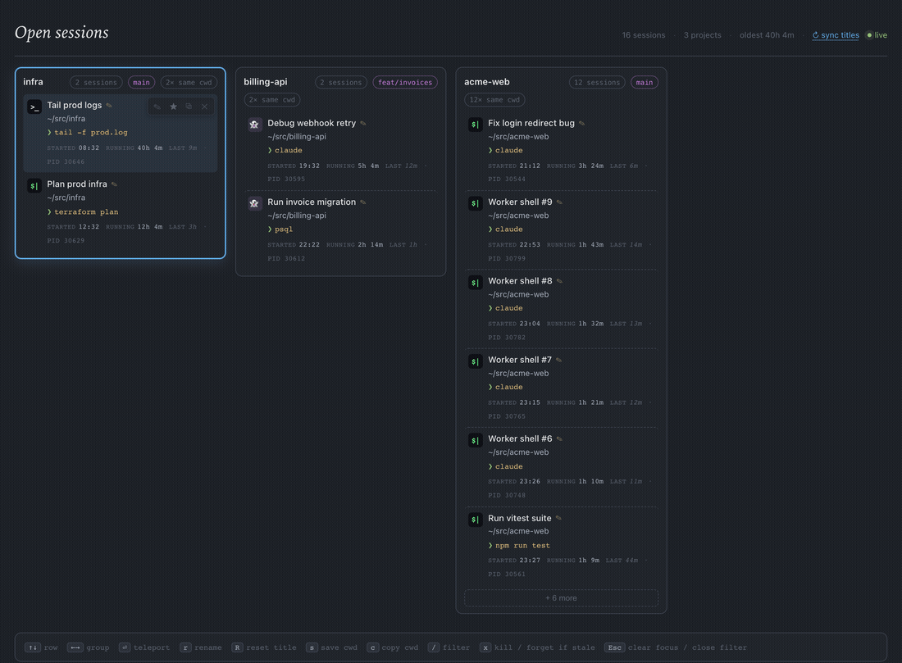

# term-tabout

> macOS 终端会话仪表盘 — 一个网页总览所有终端里的活跃 shell（iTerm2 / Ghostty / Terminal.app / VSCode 集成终端），可瞬移、重命名、收藏、清理。
>
> A macOS dashboard of every active shell across your terminals (iTerm2 / Ghostty / Terminal.app / VSCode integrated terminals) — teleport, rename, bookmark, clean up.



## 🤖 让 AI 帮你安装 / Let an AI install it

把下面这段话发给你的 AI Agent（Claude Code 等），它会读文档并自动装好、配置好：

Paste this to your AI agent (e.g. Claude Code) — it reads the doc and installs & configures everything for you:

```text
请阅读 https://raw.githubusercontent.com/isS/term-tabout/main/SETUP.md 文档，按照步骤为我安装并配置 term-tabout。
```

<details>
<summary>读不到文档？用这个自包含版本 / Can't fetch the doc? Use this self-contained prompt</summary>

如果你的 agent 不能联网、或仓库还没公开，把下面这段（命令已内联）发给它即可：

If your agent can't browse the web or the repo isn't public yet, paste this instead (commands inlined):

```text
请在 macOS 上为我安装并配置 term-tabout，按顺序执行并逐步验证：
1. 确认 `uname -s` 为 Darwin、`node -v` ≥ 18，否则停止并告诉我原因。
2. 运行 `npm install -g term-tabout`，然后 `term-tabout --help` 确认安装成功。
3. zsh 用户运行 `term-tabout --install --apply`（把 collector 写入 ~/.zshrc）；
   fish 用户改为 `echo "source $(npm root -g)/term-tabout/src/collector/term-tabout.fish" >> ~/.config/fish/config.fish`。
4. 让我打开一个新终端，运行 `term-tabout --doctor`，确认有 alive 会话。
5. 运行 `term-tabout` 启动仪表盘。
```

</details>

## 手动安装 / Manual install

```bash
npm install -g term-tabout      # 需要 Node ≥ 18 / requires Node ≥ 18
term-tabout --install --apply   # 把 collector 写入 ~/.zshrc / wire the collector into ~/.zshrc
```

打开一个**新**终端，然后运行 / Open a **new** terminal, then run:

```bash
term-tabout --doctor   # 验证 collector 已生效 / verify the collector is active
term-tabout            # 启动仪表盘，自动打开浏览器 / launch the dashboard, opens the browser
```

详细步骤、fish 配置与排错见 [SETUP.md](./SETUP.md)。
Full steps, fish setup, and troubleshooting live in [SETUP.md](./SETUP.md).
